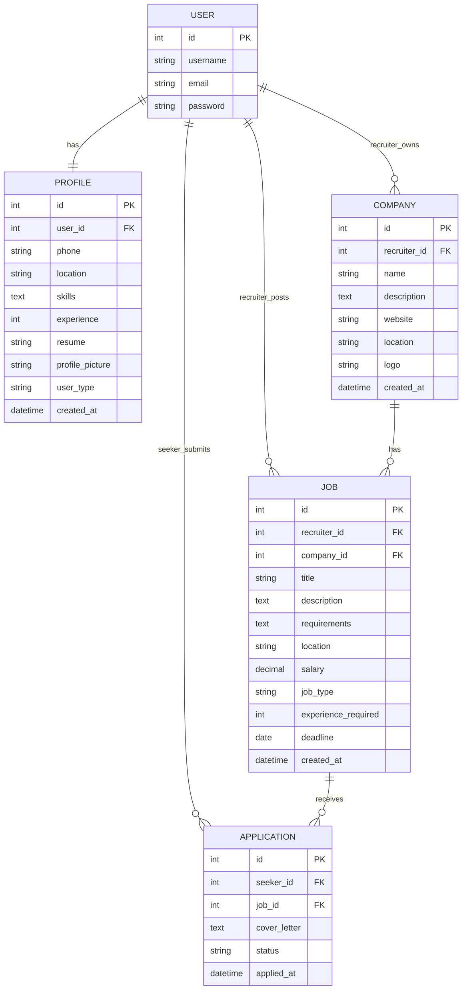

# HireHub – Entity Relationship (ER) Diagram

This ER diagram is prepared from the `models.py` files in the supplied HireHub project archive. It shows Django's built-in `auth_user` model and the project models `Profile`, `Company`, `Job`, and `Application`.

## Relationship Explanation

| Relationship | Cardinality | Foreign Key / Model Field | Explanation |
|---|---|---|---|
| User – Profile | One-to-One | `Profile.user` | Each profile belongs to exactly one user; each user can have one profile. |
| User – Company | One-to-Many | `Company.recruiter` | One recruiter can own multiple companies; each company has one recruiter. |
| User – Job | One-to-Many | `Job.recruiter` | One recruiter can post multiple jobs; each job records its recruiter. |
| Company – Job | One-to-Many | `Job.company` | One company can have multiple job postings; each job belongs to one company. |
| User – Application | One-to-Many | `Application.seeker` | One seeker can submit multiple applications; each application records one seeker. |
| Job – Application | One-to-Many | `Application.job` | One job can receive multiple applications; each application is for one job. |

## Field Notes from the Actual Models

- `Profile.user` is a `OneToOneField` to Django `User`.
- `Company.recruiter` is a `ForeignKey` to Django `User`.
- `Job.recruiter` is a `ForeignKey` to Django `User`.
- `Job.company` is a `ForeignKey` to `Company`.
- `Application.seeker` is a `ForeignKey` to Django `User`.
- `Application.job` is a `ForeignKey` to `Job`.
- Application status choices in the supplied model are `pending`, `shortlisted`, `rejected`, and `selected`.

## Database Design Observation
The supplied `Application` model does not declare a `UniqueConstraint` for `(seeker, job)`. If the system must guarantee that a seeker cannot apply to the same job more than once, add application-level validation and preferably a database uniqueness constraint, then create and apply a migration.
