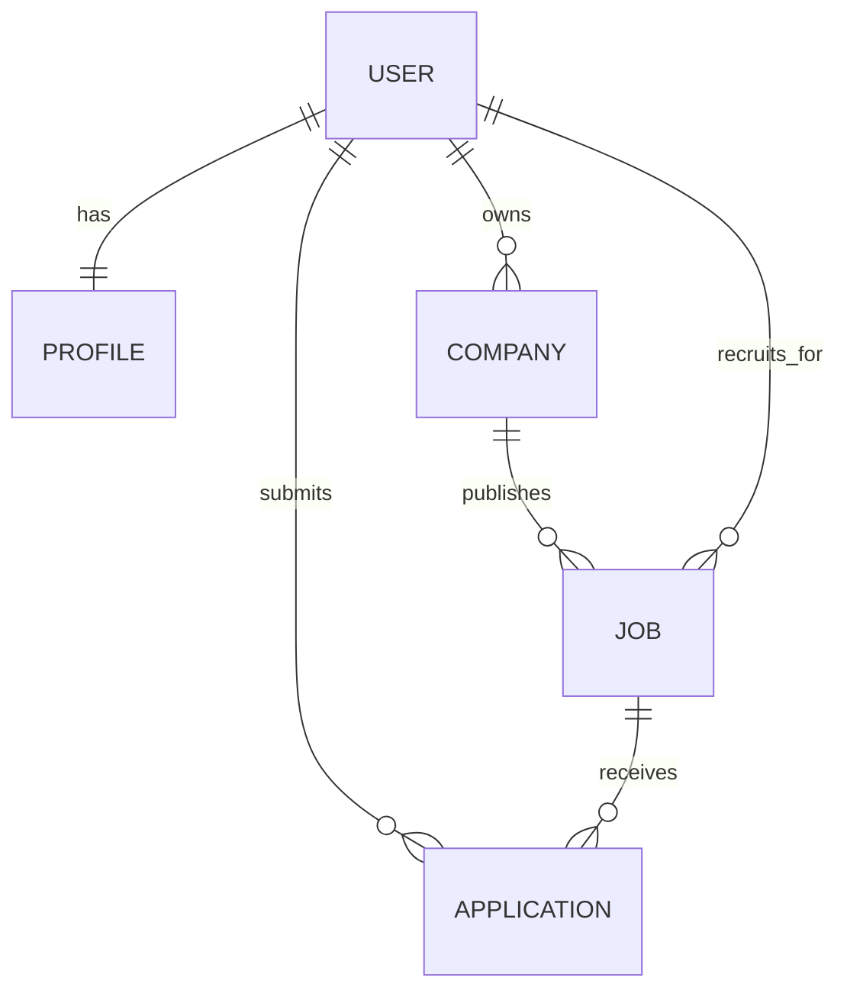

# HireHub architecture

HireHub is organized as a Django project with small apps grouped by responsibility.

| App | Responsibility |
| --- | --- |
| `accounts` | Registration, login, logout and role-aware sign-in |
| `users` | User profile, role and profile document uploads |
| `companies` | Recruiter-owned company records and logos |
| `jobs` | Job creation, listing, details, search, filters and pagination |
| `applications` | Job applications and recruiter status updates |
| `dashboard` | Role-specific seeker and recruiter summaries |
| `api` | Read-only Django REST Framework endpoints |

## Main data relationships

## Routes

- `/` – home page
- `/register/` – account registration
- `/login/` – role-selecting login
- `/users/` – profile and role-related pages
- `/company/` – recruiter company management
- `/jobs/` – job listings and job management
- `/applications/` – seeker and recruiter application pages
- `/dashboard/` – role-specific dashboard
- `/api/jobs/` – job list API
- `/api/jobs/<id>/` – job detail API
- `/api/companies/` – company list API
- `/api/applications/` – application list API

> API access permissions should be reviewed before deploying with real user data. Do not expose personal application or profile data publicly.
